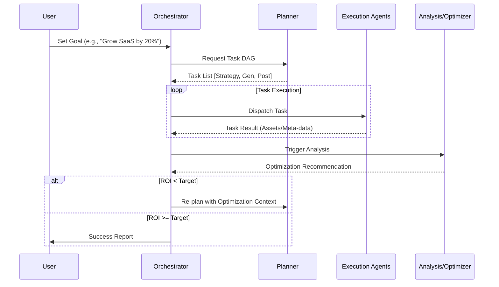

# OpenAutoGrowth Architecture & Design Specification

## 1. Project Overview
**OpenAutoGrowth** is a state-of-the-art, AI-driven growth engine designed to automate the full lifecycle of digital marketing and user acquisition. Unlike traditional automation, OpenAutoGrowth leverages a multi-agent system to achieve a **closed-loop self-optimization** cycle: Content → Execution → Analytics → Optimization → Re-plan.

## 2. Design Philosophy
The system is built on three core pillars:
- **Layered Decoupling**: Separating high-level strategy from low-level API execution.
- **Multi-Agent Collaboration**: Specialized agents handling distinct domains (copywriting, visual art, data science).
- **Dynamic Orchestration**: Using non-linear task DAGs (Directed Acyclic Graphs) to adapt to changing goals and performance data.

---

## 3. System Architecture

| Layer | Responsibility | Components |
| :--- | :--- | :--- |
| **Intelligence Layer** | Goal interpretation & task orchestration | Orchestrator, Planner |
| **Execution Layer** | Content generation & platform distribution | ContentGen, Multimodal, ChannelExec |
| **Feedback Layer** | Performance analysis & strategy refinement | Analysis, Auto-Optimizer |
| **Support Layer** | Persistence, memory, and external tools | Context Memory, Tool Registry |

### 3.1 Intelligence Layer
- **Orchestrator (The Manager)**: Interprets user intent, maintains state across the loop, and dispatches tasks to agents.
- **Planner (The Architect)**: Generates a dynamic DAG of tasks. It decides *what* needs to be done based on the goal (e.g., "A/B test these two headlines").

### 3.2 Execution Layer
- **ContentGen Agent**: Generates textual copy for different platforms (LinkedIn, Twitter, Ads).
- **Multimodal Agent**: Generates visual assets (Images via Midjourney, Videos via Runway).
- **Strategy Agent**: Determines budget allocation, target audience, and channel priority.
- **Channel Execution Agent**: Directly interfaces with Advertising APIs (Meta, Google, TikTok).

### 3.3 Feedback Layer
- **Analysis Agent**: Pulls real-time performance data (CTR, ROI, CVR) and prepares attribution reports.
- **Auto-Optimizer Agent**: The brain of the closed loop. It identifies why a campaign is failing and suggests corrective actions (e.g., "Script is good, but visual is weak; re-run Multimodal Agent").

---

## 4. Interaction Flow (The Closed Loop)

---

## 5. Technical Stack

- **Frontend**: React + Vite (Vanilla CSS for premium Glassmorphism UI)
- **Backend**: Node.js Agentic Framework
- **Memory**: Vector DB (for semantic memory) + Relational DB (for logs)
- **Agent Communication**: Event-driven WebSocket / Message Queue
- **Generative Models**: GPT-4o / Claude 3.5 (Logic), Midjourney / DALL-E 3 (Visuals)

---

## 6. Agent Specifications (Inputs/Outputs)

| Agent | Primary Input | Primary Output |
| :--- | :--- | :--- |
| **Planner** | High-level Goal | Task DAG (JSON) |
| **ContentGen** | Topic, Style, Target | Ad Copies (Array) |
| **Multimodal** | Script / Description | Image/Video URLs |
| **ChannelExec** | Asset Bundle + Channel Stats | Posting Confirmation / Campaign ID |
| **Optimizer** | Performance Metrics | Strategy Adjustments (JSON) |

---

## 7. Implementation Roadmap

### Phase 1: Core Framework (Current)
- [x] Basic Orchestrator & Planner implementation.
- [x] Dependency-aware task execution.
- [x] Mock agents for initial loop testing.
- [x] Dashboard UI (Glassmorphism design).

### Phase 2: Intelligence Expansion
- [ ] Integration with LLM for real-time Planning (Dynamic DAG generation).
- [ ] Implement Vector-based long-term memory for brand consistency.

### Phase 3: Real-world Integrations
- [ ] Connect ContentGen to OpenAI/Anthropic APIs.
- [ ] Connect ChannelExec to Meta/Google Ads sandbox.
- [ ] Live data pulling for Analysis Agent.

### Phase 4: Autopilot Mode
- [ ] Autonomous threshold-based self-correction.
- [ ] Multi-platform A/B testing automation.
