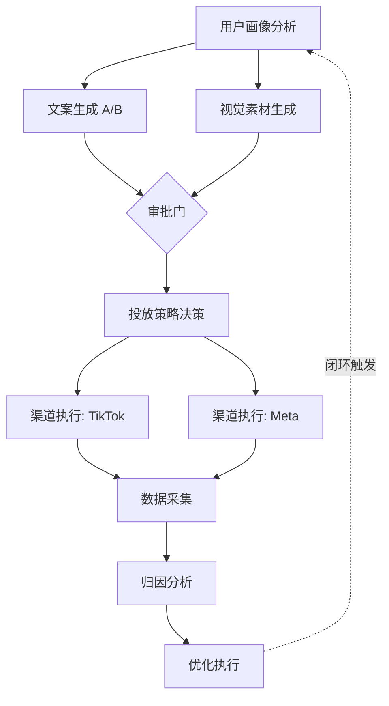

# Agent 功能设计规范 — OpenAutoGrowth

> Version: 1.0 | Updated: 2026-04-08

本文档定义系统内 8 个 Agent 的职责边界、功能规格、输入/输出契约及技术实现要点。

---

## Agent 全景图

```
用户目标
   │
   ▼
┌─────────────────────────────┐
│  1️⃣  Orchestrator Agent      │  ← 总控 / AI 项目经理
└──────────────┬──────────────┘
               │ 委托规划
               ▼
┌─────────────────────────────┐
│  2️⃣  Planner Agent           │  ← 任务 DAG 生成器
└──┬──────┬───────┬───────────┘
   │      │       │
   ▼      ▼       ▼
 3️⃣文案  4️⃣视觉  5️⃣策略      ← 三类并行生产Agent
   │      │       │
   └──────┴───────┘
               │ 资产 + 策略就绪
               ▼
┌─────────────────────────────┐
│  6️⃣  ChannelExec Agent       │  ← 渠道执行（API 集成）
└──────────────┬──────────────┘
               │ 投放完成
               ▼
┌─────────────────────────────┐
│  7️⃣  Analysis Agent          │  ← 数据拉取 & 归因
└──────────────┬──────────────┘
               │ 绩效报告
               ▼
┌─────────────────────────────┐
│  8️⃣  Optimizer Agent         │  ← 闭环优化（触发重跑）
└──────────────┬──────────────┘
               │ 优化指令
               ▼
          Orchestrator（形成闭环）
```

---

## 1️⃣ Orchestrator Agent — 总控大脑

### 职责定位
等同于 **AI 项目经理**：接收用户目标，全程管理任务生命周期，根据实时状态动态决策下一步行动。

### 核心功能
| 功能 | 说明 |
| :--- | :--- |
| **目标解析** | 将自然语言目标（"Q2 冲刺 GMV 5亿"）转化为结构化 Campaign 对象 |
| **动态路由** | 根据当前任务状态和 Agent 能力动态选择下一个执行 Agent |
| **异常处理** | 监听 Agent 失败事件，触发重试或降级处理 |
| **人工审批门** | 在高风险节点（预算超限、新渠道首次投放）暂停并等待人工确认 |
| **状态持久化** | 将 Campaign 全程状态写入 Memory 层，支持断点续跑 |

### 输入规范
```json
{
  "goal": "为新品 X 进行冷启动推广",
  "budget": { "total": 50000, "currency": "CNY" },
  "timeline": { "start": "2026-04-10", "end": "2026-04-30" },
  "kpi": { "metric": "GMV", "target": 500000 },
  "constraints": { "channels": ["tiktok", "wechat"], "region": "CN" }
}
```

### 输出规范
```json
{
  "campaign_id": "camp_20260408_001",
  "status": "RUNNING",
  "plan_id": "plan_20260408_001",
  "active_tasks": ["t2", "t3"],
  "loop_count": 1
}
```

---

## 2️⃣ Planner Agent — 任务 DAG 生成器

### 职责定位
**非固定流程**规划者：根据 Campaign 目标、历史经验、当前业务上下文，动态生成最优任务 DAG。

### 核心功能
| 功能 | 说明 |
| :--- | :--- |
| **目标分解** | 将 KPI 拆解为可执行的叶子任务 |
| **依赖分析** | 确定任务间的前置依赖（文案依赖用户画像，执行依赖素材） |
| **并行识别** | 识别可同时执行的任务（文案生成 ∥ 图片生成） |
| **历史复用** | 从 Memory 中检索相似 Campaign 的成功 DAG 作为参考 |
| **DAG 输出** | 以结构化 JSON 输出，供 Orchestrator 调度执行 |

### 典型 DAG 示例（新品冷启动）



### DAG 数据结构
```json
{
  "plan_id": "plan_001",
  "tasks": [
    { "id": "t1", "type": "UserProfiler", "deps": [] },
    { "id": "t2", "type": "ContentGen", "deps": ["t1"], "parallel_group": "gen" },
    { "id": "t3", "type": "Multimodal",  "deps": ["t1"], "parallel_group": "gen" },
    { "id": "t4", "type": "Strategy",    "deps": ["t2", "t3"] },
    { "id": "t5", "type": "ChannelExec", "deps": ["t4"] },
    { "id": "t6", "type": "Analysis",    "deps": ["t5"] },
    { "id": "t7", "type": "Optimizer",   "deps": ["t6"] }
  ]
}
```

---

## 3️⃣ ContentGen Agent — 文案生成

### 职责定位
生产高质量、多平台适配的营销文案，支持 **A/B 多版本**，匹配品牌调性。

### 核心功能
| 功能 | 说明 |
| :--- | :--- |
| **风格适配** | 根据渠道切换：TikTok（口语化/emoji）、LinkedIn（专业/数据驱动）、微信（亲切/品牌感） |
| **A/B 版本** | 默认输出 3 个差异化版本（标题、Hook、CTA 组合各异） |
| **用户画像注入** | 接收 UserProfiler 的画像数据，定向措辞（"妈妈们"vs"创业者"） |
| **长度控制** | 自动适配各平台字数限制（微博140、Twitter 280、Google 30+90） |
| **品牌安全** | 内置关键词审核，避免违禁词 |

### 输入
```json
{
  "product": { "name": "X Pro", "category": "SaaS", "USP": ["AI驱动", "一键部署"] },
  "target_persona": { "age": "25-35", "interest": ["创业", "效率工具"] },
  "channels": ["tiktok", "weibo"],
  "tone": "energetic",
  "ab_variants": 3
}
```

### 输出
```json
{
  "variants": [
    { "id": "copy_v1", "hook": "你还在手动做报表？", "body": "...", "cta": "免费试用" },
    { "id": "copy_v2", "hook": "老板要数据？10秒搞定", "body": "...", "cta": "立即体验" },
    { "id": "copy_v3", "hook": "团队效率提升 3 倍的秘密", "body": "...", "cta": "查看案例" }
  ],
  "metadata": { "language": "zh-CN", "word_count_avg": 85 }
}
```

---

## 4️⃣ Multimodal Agent — 视觉素材生成

### 职责定位
生产与文案匹配的**视觉内容**，包括图片广告和短视频脚本/视频素材。

### 核心功能
| 功能 | 说明 |
| :--- | :--- |
| **图片生成** | 调用 DALL-E 3 / Midjourney API 生成品牌风格图片 |
| **视频生成** | 调用 Runway Gen-3 / Pika 生成 15s/30s 短视频素材 |
| **风格一致性** | 维护品牌 Style Guide（主色、字体、构图偏好）作为生成约束 |
| **尺寸适配** | 自动生成多尺寸版本（1:1 / 9:16 / 16:9 / 4:5） |
| **素材打标** | 为每个素材打上风格、对象、平台兼容性标签，便于 Analysis 做归因 |

### 技术集成
```
图片：OpenAI DALL-E 3 API → Midjourney API（备用）
视频：Runway ML API → Pika API（备用）→ Sora API（未来）
```

### 输入/输出
```json
// 输入
{ "copy_ref": "copy_v1", "style": "minimalist", "brand_colors": ["#6366f1"], "sizes": ["9:16", "1:1"] }

// 输出
{
  "assets": [
    { "id": "img_001", "type": "image", "url": "...", "size": "9:16", "tool": "DALL-E 3" },
    { "id": "vid_001", "type": "video", "url": "...", "duration": 15, "tool": "Runway Gen-3" }
  ]
}
```

---

## 5️⃣ Strategy Agent — 投放策略决策

### 职责定位
分析目标人群与业务 KPI，决定**投什么渠道、针对什么人群、如何分配预算**。

### 核心功能
| 功能 | 说明 |
| :--- | :--- |
| **渠道评分** | 结合历史 ROI 数据和人群匹配度对 Meta/Google/TikTok/微信进行评分排序 |
| **预算分配** | 基于渠道权重和 A/B 实验预留比例输出预算分配方案 |
| **人群定向** | 生成各渠道的受众包（年龄、兴趣、行为、Lookalike） |
| **出价策略** | 智能推荐出价方式（CPM / CPC / ROAS Target） |
| **时段规划** | 基于历史数据推荐投放时段（如：晚上 8-10 点 CTR 最高） |

### 输出示例
```json
{
  "channel_plan": [
    { "channel": "tiktok", "budget": 20000, "audience": {...}, "bid_strategy": "ROAS_TARGET", "roas_target": 3.0 },
    { "channel": "meta",   "budget": 15000, "audience": {...}, "bid_strategy": "CPM", "daily_cap": 1000 },
    { "channel": "google", "budget": 15000, "audience": {...}, "bid_strategy": "CPC", "max_cpc": 5.0 }
  ],
  "ab_split": { "variant_a": 0.6, "variant_b": 0.4 }
}
```

---

## 6️⃣ ChannelExec Agent — 渠道执行

### 职责定位
**唯一直接调用广告平台 API 的 Agent**，负责将策略和素材转化为真实的广告活动。

### 核心功能
| 功能 | 说明 |
| :--- | :--- |
| **多平台适配** | 封装 Meta / Google / TikTok / 微信 API 差异，提供统一执行接口 |
| **广告创建** | 自动创建 Campaign → AdSet → Ad 的完整三层结构 |
| **素材上传** | 将 Multimodal Agent 生成的图片/视频上传至各平台素材库 |
| **重试机制** | 指数退避重试（最多 3 次），超时后报警并通知 Orchestrator |
| **执行日志** | 记录每次 API 调用的请求/响应，供 Analysis Agent 关联 |

### API 集成映射
```
TikTok  →  TikTok for Business API v2
Meta    →  Meta Marketing API v18.0
Google  →  Google Ads API v15
微信    →  微信广告投放 API
```

### 输入/输出
```json
// 输入
{
  "channel": "tiktok",
  "assets": ["img_001", "vid_001"],
  "copies": ["copy_v1"],
  "strategy": { "budget": 20000, "audience": {...}, "schedule": { "start": "2026-04-10" } }
}

// 输出
{
  "campaign_id": "tiktok_camp_78912",
  "ad_ids": ["ad_001", "ad_002"],
  "status": "ACTIVE",
  "spend_cap": 20000
}
```

---

## 7️⃣ Analysis Agent — 数据采集与归因

### 职责定位
**所有数据的入口**：定时拉取各平台广告数据，完成统一归因分析，生成 Optimizer 所需的绩效报告。

### 核心功能
| 功能 | 说明 |
| :--- | :--- |
| **多源数据拉取** | 从 TikTok / Meta / Google Ads API 拉取曝光、点击、转化数据 |
| **归因分析** | 支持 Last-Click / Data-Driven / Linear 多种归因模型 |
| **KPI 计算** | 计算 CTR、CVR、CPA、ROAS、ROI 等核心指标 |
| **异常检测** | 发现 CTR 异常下降（>20%）或 CPM 飙升时触发告警 |
| **素材归因** | 将转化结果关联回具体的 copy_id、asset_id，用于指导 Optimizer |

### 输出示例
```json
{
  "report_id": "rpt_001",
  "period": "2026-04-10 to 2026-04-15",
  "summary": { "spend": 25000, "revenue": 75000, "roi": 3.0, "ctr": 0.042 },
  "by_variant": [
    { "copy_id": "copy_v1", "ctr": 0.051, "cvr": 0.032, "roas": 3.8 },
    { "copy_id": "copy_v2", "ctr": 0.033, "cvr": 0.020, "roas": 2.1 }
  ],
  "anomalies": [{ "channel": "meta", "metric": "cpm", "severity": "HIGH", "change": "+45%" }]
}
```

---

## 8️⃣ Optimizer Agent — 闭环优化核心

### 职责定位
**整个系统的闭环引擎**：读取 Analysis 报告，决定优化动作，并向 Orchestrator 发出"重跑"指令，形成自优化系统。

### 核心功能
| 功能 | 说明 |
| :--- | :--- |
| **A/B 结果裁决** | 统计显著性检验（p < 0.05），选出胜出版本，停止落败版本 |
| **文案重写触发** | CTR 低于基准 30% 时，向 ContentGen Agent 发出"重写指令" |
| **预算再分配** | 将预算向 ROAS 高的渠道/变体倾斜 |
| **受众扩展** | 对转化率高的受众包触发 Lookalike 扩展 |
| **策略迭代** | 将本次优化结论写入 Memory，供下次 Planner 参考 |
| **闭环触发** | 向 Orchestrator 发出新一轮 Campaign 的触发信号 |

### 决策规则（规则引擎 + LLM 混合）
```
IF ctr < baseline * 0.7 → 触发 ContentGen 重写 (high priority)
IF roas < 2.0           → 暂停低效渠道，预算归拢
IF winner_confidence > 0.95 → 停止 B 版本，全量跑 A
IF anomaly.severity == HIGH  → 暂停所有投放，通知 Orchestrator
```

### 输入/输出
```json
// 输入
{ "report": { ...analysis_report... }, "kpi_target": { "roas": 3.0 } }

// 输出
{
  "actions": [
    { "type": "PAUSE_VARIANT", "target": "copy_v2" },
    { "type": "REALLOCATE_BUDGET", "from": "meta", "to": "tiktok", "amount": 5000 },
    { "type": "TRIGGER_REWRITE", "agent": "ContentGen", "reason": "CTR below threshold" }
  ],
  "next_loop": { "trigger": true, "loop_count": 2 }
}
```
