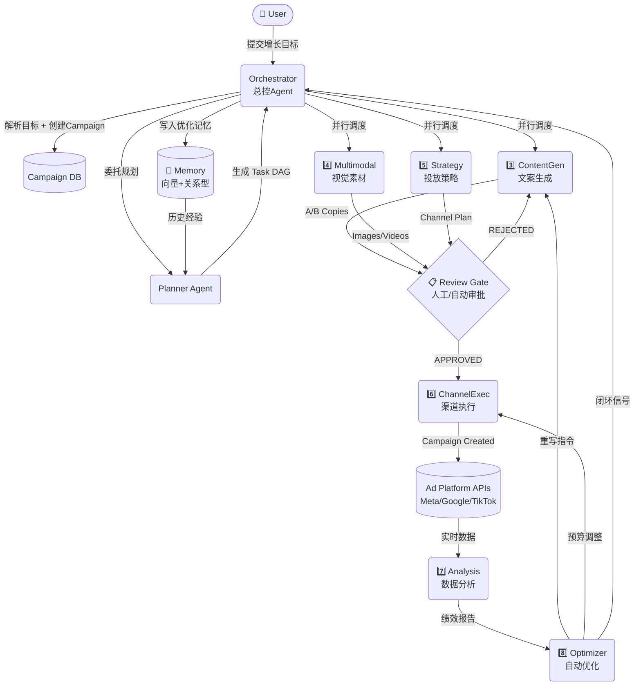
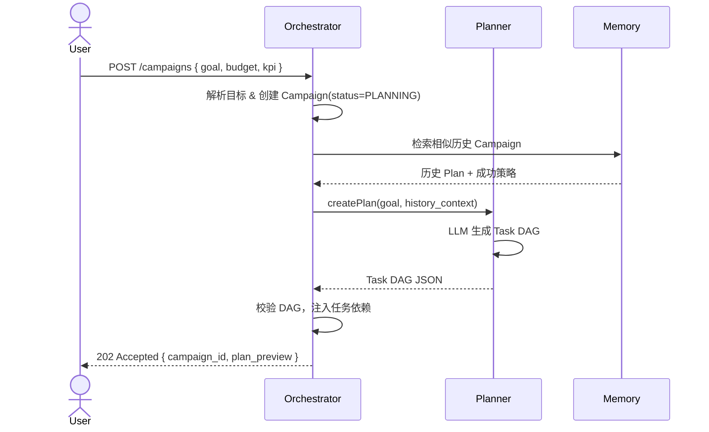
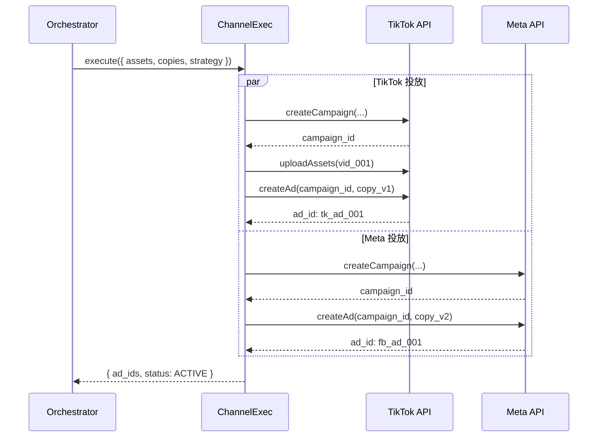
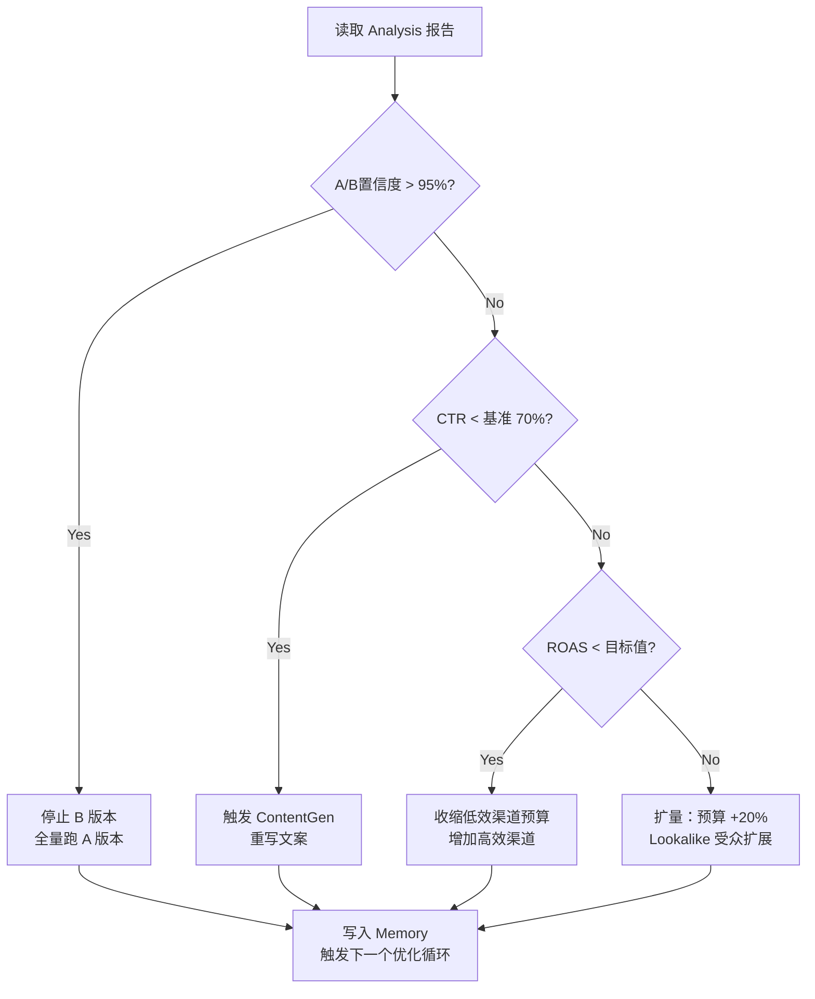

# 核心业务链路建模 — OpenAutoGrowth

> Version: 1.0 | Updated: 2026-04-08

本文档对 OpenAutoGrowth 的**核心业务主流程**进行精确建模，包括完整时序、关键分叉决策点、及各层交互协议。

---

## 1. 核心业务链路全景



---

## 2. Phase 1：目标接收与规划

### 时序图



### 关键决策点
- **相似 Campaign 存在？** → 复用历史 DAG 结构，仅调整参数（加快 50% 规划速度）
- **新目标类型？** → 完全由 LLM 从头生成 DAG，走人工确认

---

## 3. Phase 2：内容与素材并行生产

### 并行执行策略

```
Task DAG 中 parallel_group = "gen" 的任务同时启动
│
├─ ContentGen Agent (Thread A)
│    ├─ 调用 GPT-4o → 生成 3个A/B文案版本
│    └─ 返回 copies[]
│
└─ Multimodal Agent (Thread B)
     ├─ 调用 DALL-E 3 → 生成图片素材
     ├─ 调用 Runway Gen-3 → 生成视频素材
     └─ 返回 assets[]
│
Wait for all → 触发 Strategy Agent
```

### Review Gate 逻辑
```
自动通过条件（满足全部）：
  ✓ 文案无违禁词
  ✓ 图片安全检测通过
  ✓ 预算 ≤ 自动审批上限（$10,000）

强制人工审批条件（满足任意）：
  ✗ 首次投放新渠道
  ✗ 预算 > $10,000
  ✗ 涉及竞品对比文案
  ✗ 新产品品类首次投放
```

---

## 4. Phase 3：投放执行

### ChannelExec 调用协议



---

## 5. Phase 4：监控与闭环优化

### 数据采集周期

| 频率 | 触发条件 | 执行内容 |
| :--- | :--- | :--- |
| 实时 | 异常告警（CPM +50%） | 立即拉数据，通知 Orchestrator |
| 每小时 | 投放活跃期 | 增量数据同步，刷新 Dashboard |
| 每天 23:00 | 日常例行 | 全量日报 + 归因分析 + Optimizer 触发 |
| 活动结束 | Campaign 结束事件 | 完整复盘报告 + 经验写入 Memory |

### Optimizer 决策流程图



---

## 6. 错误处理与降级策略

| 场景 | 降级处理 |
| :--- | :--- |
| ContentGen 超时 | 使用 Memory 中历史高分文案，标记为"复用" |
| Multimodal API 失败 | 降级到模板素材库，通知 Design Team |
| ChannelExec API 限流 | 指数退避重试，3 次后转人工处理队列 |
| Analysis 数据延迟 | 使用上一个周期数据进行 Optimizer 决策，打上"数据滞后"标记 |
| Optimizer 无法裁决 | 输出"人工决策所需"报告，等待用户输入 |
