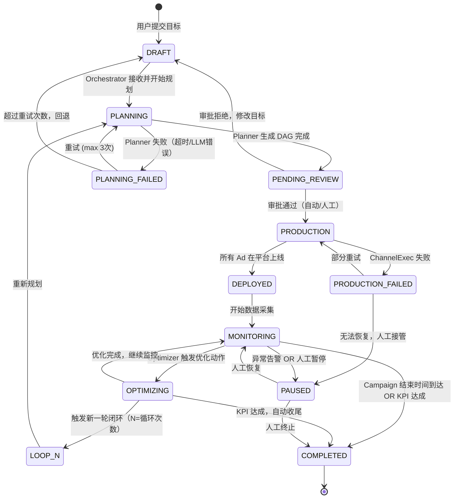
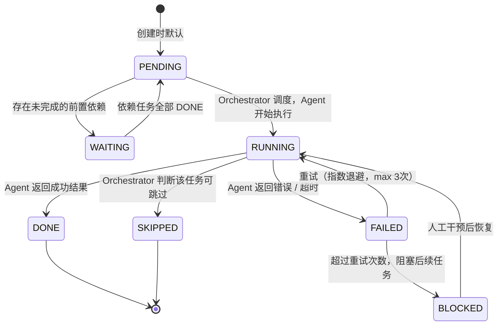
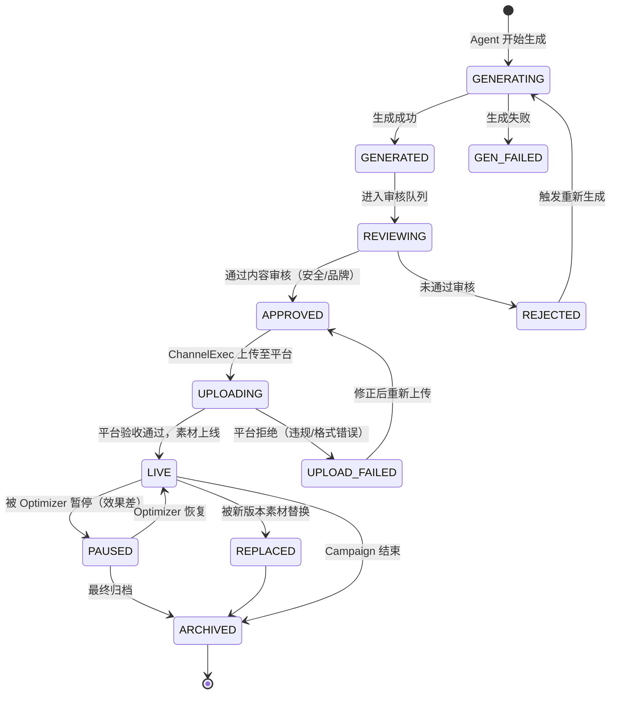
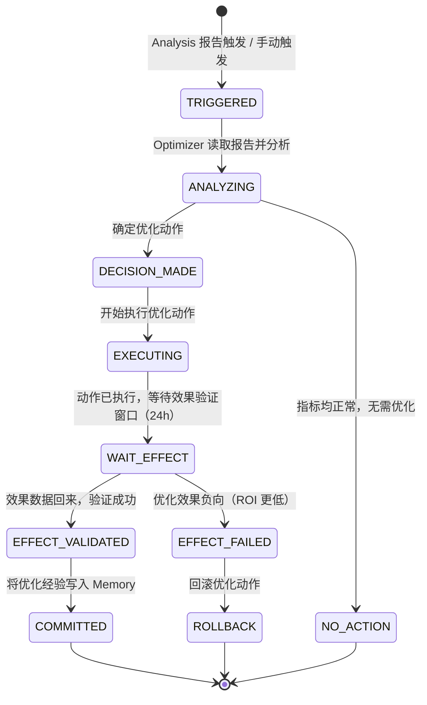

# 业务状态机设计 — OpenAutoGrowth

> Version: 1.0 | Updated: 2026-04-08

本文档对系统中核心业务对象的**状态机**进行精确定义，明确每个状态的含义、合法转换路径及触发条件。

---

## 1. Campaign 状态机（最顶层）

Campaign 是系统中的核心聚合根，代表一次完整的增长投放活动。

### 状态说明表

| 状态 | 含义 | 允许的 Actor 操作 |
| :--- | :--- | :--- |
| `DRAFT` | 草稿，等待确认 | 用户可编辑目标/预算 |
| `PLANNING` | Planner 正在生成 DAG | 只读 |
| `PENDING_REVIEW` | 等待审批（素材+预算） | 人工可 Approve / Reject |
| `PRODUCTION` | 内容生产 + 渠道执行中 | 只读 |
| `DEPLOYED` | 广告已在平台上线 | 用户可查看实时数据 |
| `MONITORING` | 周期性数据采集中 | 用户可手动触发优化 |
| `OPTIMIZING` | Optimizer 正在执行调整 | 只读 |
| `LOOP_N` | 第 N 次闭环，重新规划 | 用户可中断循环 |
| `PAUSED` | 人工暂停 / 异常暂停 | 用户可 Resume / Stop |
| `COMPLETED` | 已结束，生成复盘报告 | 只读，可导出报告 |

---

## 2. Task 状态机（DAG 节点级别）

每个 DAG 中的 Task 节点有独立状态机，由 Orchestrator 管理。

---

## 3. ContentAsset 状态机（素材级别）

对每一份文案/图片/视频素材的生命周期进行追踪。

---

## 4. OptimizationLoop 状态机（优化循环）

---

## 5. 状态转换事件总览

| 事件名称 | 发送方 | 接收方 | 触发的主要状态变化 |
| :--- | :--- | :--- | :--- |
| `goal.submitted` | User | Orchestrator | Campaign: DRAFT → PLANNING |
| `plan.ready` | Planner | Orchestrator | Campaign: PLANNING → PENDING_REVIEW |
| `review.approved` | User / AutoReviewer | Orchestrator | Campaign: PENDING_REVIEW → PRODUCTION |
| `ad.deployed` | ChannelExec | Orchestrator | Campaign: PRODUCTION → DEPLOYED |
| `analysis.report_ready` | Analysis | Optimizer | Loop: TRIGGERED → ANALYZING |
| `optimizer.action_applied` | Optimizer | Orchestrator | Campaign: MONITORING → OPTIMIZING |
| `kpi.achieved` | Orchestrator | System | Campaign: * → COMPLETED |
| `anomaly.detected` | Analysis | Orchestrator | Campaign: MONITORING → PAUSED |
