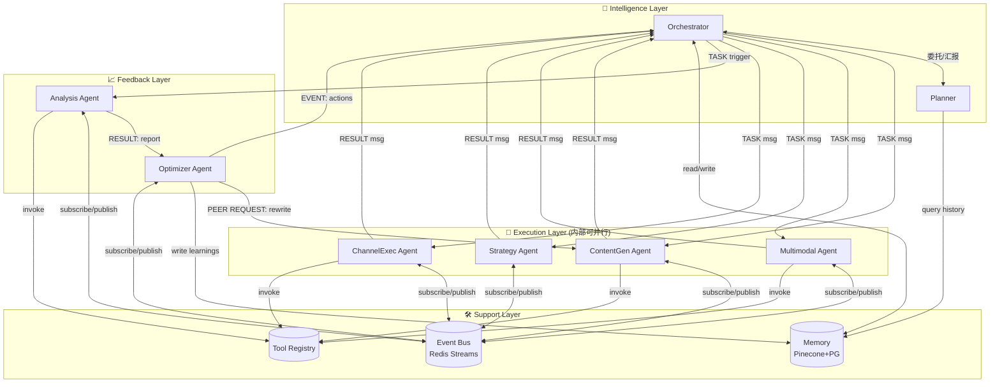

# 智能体协作架构设计 — OpenAutoGrowth

> Version: 1.0 | Updated: 2026-04-09

---

## 1. 协作模式选型

OpenAutoGrowth 采用 **"Supervisor + Peer" 混合协作模型**：

| 关系 | 模式 | 适用场景 |
| :--- | :--- | :--- |
| Orchestrator → 执行 Agent | **Supervisor（监督式）** | 总控委派任务，Agent 汇报结果 |
| ContentGen ∥ Multimodal | **Peer Parallel（对等并行）** | 互不依赖，并发生成 |
| Optimizer → ContentGen | **Peer Request（对等请求）** | 优化 Agent 向生产 Agent 发重写请求 |
| Analysis → Optimizer | **Pipeline（流水线）** | 数据严格单向流动 |

---

## 2. 协作协议规范

每个 Agent 通过 **标准化消息信封（AgentMessage Envelope）** 通信，禁止直接调用：

```typescript
interface AgentMessage {
  id:          string;          // message UUID
  from:        AgentType;       // 发送方
  to:          AgentType;       // 目标方 (可以是 BROADCAST)
  type:        MessageType;     // TASK | RESULT | EVENT | HEARTBEAT
  priority:    'HIGH' | 'NORMAL' | 'LOW';
  campaign_id: string;
  task_id:     string;
  payload:     unknown;         // 业务数据（类型由 type+from 决定）
  timestamp:   ISO8601String;
  ttl_ms:      number;          // 消息过期时间
  retry_count: number;
  trace_id:    string;          // 全链路追踪 ID
}

type MessageType = 'TASK' | 'RESULT' | 'EVENT' | 'HEARTBEAT' | 'ERROR';
```

---

## 3. 协作拓扑图



---

## 4. Agent 注册与发现

```typescript
// Agent 能力声明（启动时注册到 Registry）
interface AgentCapability {
  agent_id:     string;
  agent_type:   AgentType;
  version:      string;
  accepts:      MessageType[];      // 能处理的消息类型
  concurrency:  number;             // 最大并发任务数
  timeout_ms:   number;             // 单任务超时
  requires:     ToolName[];         // 依赖的外部工具
  health_endpoint: string;
}
```

Orchestrator 在 Task 调度时，从 Registry 动态查询可用 Agent：
- **优先选择负载最低**的同类型 Agent 实例（支持横向扩展）
- Agent 实例宕机时，Orchestrator 自动路由到备用实例

---

## 5. 并发冲突处理

| 冲突场景 | 解决方案 |
| :--- | :--- |
| 多个 Optimizer 同时修改预算 | 乐观锁（version 字段），冲突时后写方重试 |
| ContentGen 和 Optimizer 同时写 Copy 状态 | Campaign 级别的分布式锁（Redis SETNX） |
| Analysis 数据未就绪时 Optimizer 触发 | Optimizer 订阅 `ReportGenerated` 事件后才执行 |
| Task 重复执行（幂等性） | Task 以 `(campaign_id + task_key)` 为幂等键 |

---

## 6. 健康检查与熔断

```
每个 Agent 每 10s 向 Event Bus 发布 HEARTBEAT
Orchestrator 维护 Agent 心跳表

Agent 熔断触发条件：
  连续 3 次 HEARTBEAT 未收到  →  标记为 DEGRADED
  DEGRADED 状态下继续失败      →  标记为 CIRCUIT_OPEN
  CIRCUIT_OPEN 时的请求        →  立即失败 + 降级处理
  60s 后自动尝试 HALF_OPEN     →  放行 1 个探针请求
```
