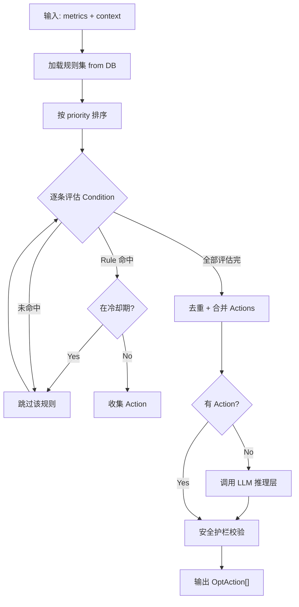

# 规则引擎设计 — OpenAutoGrowth

> Version: 1.0 | Updated: 2026-04-09

---

## 1. 规则引擎定位

规则引擎服务于两个核心场景：

| 场景 | 说明 |
| :--- | :--- |
| **Optimizer 决策引擎** | 根据绩效数据，确定性地输出优化动作 |
| **Review Gate 审批引擎** | 判断内容/预算是否需要人工介入 |

---

## 2. 架构：混合推理（规则 + LLM）

```
输入数据（报告/素材/预算）
         │
         ▼
  ┌──────────────────┐
  │  1. 确定性规则层  │  ← 速度快、可解释、不消耗 Token
  │  (Rule Engine)   │    处理明确阈值场景
  └────────┬─────────┘
           │ 规则未命中（模糊场景）
           ▼
  ┌──────────────────┐
  │  2. LLM 推理层   │  ← 处理复杂/模糊场景
  │  (GPT-4o)        │    输出结构化 JSON 决策
  └────────┬─────────┘
           │
           ▼
  ┌──────────────────┐
  │  3. 决策校验层   │  ← 安全护栏：预算上限/违规拦截
  └──────────────────┘
           │
           ▼
      OptimizationAction[]
```

---

## 3. 规则定义规范（DSL）

```typescript
interface Rule {
  id:          string;
  name:        string;
  priority:    number;       // 数值越小优先级越高，先命中先执行
  condition:   Condition;    // 触发条件（组合表达式）
  action:      Action;       // 输出动作
  cooldown_ms: number;       // 同一 campaign 同一规则的冷却时间
  enabled:     boolean;
}

interface Condition {
  operator: 'AND' | 'OR' | 'NOT';
  children: (Condition | Predicate)[];
}

interface Predicate {
  field:    string;          // 如 "metrics.ctr", "budget.spend_rate"
  op:       '>' | '<' | '>=' | '<=' | '==' | 'IN' | 'NOT_IN';
  value:    number | string | string[];
}

interface Action {
  type:     ActionType;
  params:   Record<string, unknown>;
}

type ActionType =
  | 'PAUSE_VARIANT'
  | 'REALLOCATE_BUDGET'
  | 'TRIGGER_REWRITE'
  | 'SCALE_BUDGET'
  | 'EXPAND_AUDIENCE'
  | 'PAUSE_CHANNEL'
  | 'ALERT_HUMAN'
  | 'TRIGGER_REPLAN';
```

---

## 4. 内置规则集（Optimizer 决策）

```yaml
rules:
  - id: R001
    name: "A/B 裁决 - 置信度达标"
    priority: 1
    condition:
      operator: AND
      children:
        - field: ab_test.winner_confidence
          op: ">="
          value: 0.95
        - field: ab_test.min_sample_size_met
          op: "=="
          value: true
    action:
      type: PAUSE_VARIANT
      params: { target: "loser_variant_id" }
    cooldown_ms: 86400000   # 24h

  - id: R002
    name: "CTR 严重低于基准"
    priority: 2
    condition:
      operator: AND
      children:
        - field: metrics.ctr
          op: "<"
          value: "baseline.ctr * 0.7"
        - field: metrics.impressions
          op: ">="
          value: 1000
    action:
      type: TRIGGER_REWRITE
      params: { agent: "ContentGen", urgency: "HIGH" }
    cooldown_ms: 43200000   # 12h

  - id: R003
    name: "ROAS 不达标 - 预算收缩"
    priority: 3
    condition:
      operator: AND
      children:
        - field: metrics.roas
          op: "<"
          value: 2.0
        - field: campaign.loop_count
          op: "<"
          value: 5
    action:
      type: REALLOCATE_BUDGET
      params: { shrink_pct: 0.3, reallocate_to: "best_channel" }
    cooldown_ms: 21600000   # 6h

  - id: R004
    name: "ROI 超额 - 提速扩量"
    priority: 4
    condition:
      field: metrics.roas
      op: ">="
      value: "kpi.target_roas * 1.2"
    action:
      type: SCALE_BUDGET
      params: { scale_pct: 0.2 }
    cooldown_ms: 43200000

  - id: R005
    name: "异常告警 - 人工介入"
    priority: 0  # 最高优先级
    condition:
      operator: OR
      children:
        - field: anomalies.cpm_surge_pct
          op: ">="
          value: 0.5
        - field: anomalies.ctr_drop_pct
          op: ">="
          value: 0.4
    action:
      type: ALERT_HUMAN
      params: { pause_campaign: true, notify: ["ops_team"] }
    cooldown_ms: 3600000
```

---

## 5. 内置规则集（Review Gate 审批）

```yaml
review_rules:
  - id: RG001
    name: "预算超自动审批上限"
    condition:
      field: campaign.budget_total
      op: ">"
      value: 100000
    action:
      type: REQUIRE_HUMAN_APPROVAL
      params: { reason: "Budget exceeds auto-approve limit" }

  - id: RG002
    name: "首次投放新渠道"
    condition:
      field: channel.is_first_time
      op: "=="
      value: true
    action:
      type: REQUIRE_HUMAN_APPROVAL
      params: { reason: "New channel, manual review required" }

  - id: RG003
    name: "文案包含竞品词"
    condition:
      field: copy.has_competitor_mention
      op: "=="
      value: true
    action:
      type: REQUIRE_HUMAN_APPROVAL
      params: { reason: "Competitive content requires legal sign-off" }
```

---

## 6. 规则引擎执行流程


