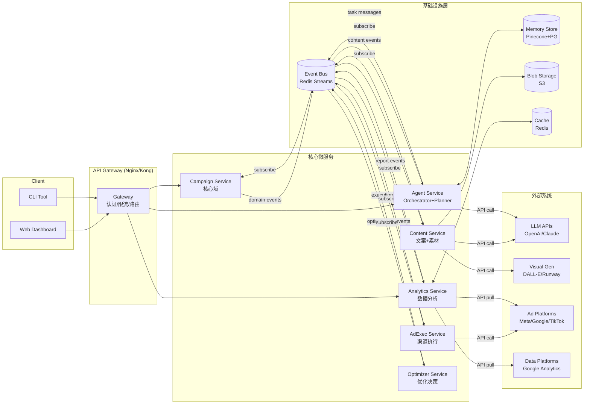

# 数据流与服务边界划分 — OpenAutoGrowth

> Version: 1.0 | Updated: 2026-04-09

---

## 1. 服务拆分原则

按照**"高内聚、低耦合"**和**限界上下文边界**拆分微服务：
- 每个服务拥有独立数据库（数据所有权清晰）
- 跨服务通信必须通过 API 或事件总线（绝不直接访问他人数据库）
- 单服务可独立部署和扩展

---

## 2. 服务全景图



---

## 3. 服务边界与数据所有权

| 服务 | 拥有的数据 | 暴露的接口 | 消费的事件 | 发布的事件 |
| :--- | :--- | :--- | :--- | :--- |
| **Campaign Service** | campaigns, plans, tasks | REST CRUD, WebSocket状态推送 | `OptimizationApplied`, `AdDeployed` | `CampaignCreated`, `StatusChanged` |
| **Agent Service** | agent_contexts, memories (向量) | gRPC (内部) | `CampaignCreated`, `ReportGenerated` | `PlanGenerated`, `TaskDispatched` |
| **Content Service** | copies, content_assets, style_guides | REST | `TaskDispatched(ContentGen)`, `RewriteRequested` | `ContentApproved`, `ContentRejected` |
| **AdExec Service** | ad_campaigns, ad_groups, ads | REST | `ContentApproved`, `StrategyDecided` | `AdDeployed`, `AdPaused`, `AdFailed` |
| **Analytics Service** | performance_reports, channel_stats, attributions | REST, Streaming | `AdDeployed` | `ReportGenerated`, `AnomalyDetected` |
| **Optimizer Service** | optimization_records, rules | REST (规则管理) | `ReportGenerated`, `AnomalyDetected` | `OptimizationApplied`, `RewriteRequested` |

---

## 4. 核心数据流（端到端追踪）

### 4.1 投放创建流（写路径）

```
User POST /campaigns
  → Campaign Service: 写 campaigns 表，发布 CampaignCreated 事件
  → Agent Service: 消费事件，调用 LLM 生成 Plan，写 plan+tasks 表，发布 PlanGenerated
  → Campaign Service: 消费 PlanGenerated，更新 campaign.status = PENDING_REVIEW
  → [Review Gate] 自动或人工批准
  → Agent Service: 并发调度 ContentGen & Multimodal & Strategy Task
  → Content Service: 生成文案/素材，写 copies+content_assets，发布 ContentApproved
  → Agent Service: 收到所有依赖完成，调度 ChannelExec Task
  → AdExec Service: 调用平台 API，写 ad_campaigns+ads，发布 AdDeployed
  → Campaign Service: 消费 AdDeployed，更新 status = MONITORING
```

### 4.2 优化闭环流（读写混合路径）

```
Analytics Service (定时器 / Webhook)
  → 拉取平台数据，计算 KPI，写 performance_reports，发布 ReportGenerated

Optimizer Service (消费 ReportGenerated)
  → 加载规则集，执行规则引擎，生成 OptAction[]
  → 写 optimization_records
  → 发布 OptimizationApplied（含 actions）

各服务按需消费 OptimizationApplied:
  AdExec Service: 调整预算/暂停 Ad
  Content Service: 接受 TRIGGER_REWRITE，重新生成文案
  Campaign Service: 更新 loop_count，若 KPI 达成发布 KPIAchieved
```

---

## 5. 事件 Schema 规范

```typescript
// 所有事件继承基础结构
interface DomainEvent {
  event_id:    string;          // UUID
  event_type:  string;          // 如 "CampaignCreated"
  version:     string;          // 事件 Schema 版本, "1.0"
  occurred_at: ISO8601String;
  campaign_id: string;
  trace_id:    string;          // 跨服务链路追踪
  payload:     unknown;         // 具体业务数据
}

// 示例：ReportGenerated 事件
interface ReportGeneratedEvent extends DomainEvent {
  event_type: 'ReportGenerated';
  payload: {
    report_id:  string;
    metrics:    { ctr: number; roas: number; spend: number; revenue: number };
    anomalies:  Anomaly[];
  };
}
```

---

## 6. 数据一致性策略

| 场景 | 一致性模型 | 实现方式 |
| :--- | :--- | :--- |
| Campaign 状态更新 | **强一致** | 单服务内部事务 + 状态机校验 |
| 跨服务数据同步 | **最终一致** | 事件溯源（Event Sourcing） + Outbox Pattern |
| Task 并发调度 | **幂等性** | 幂等键 `(campaign_id + task_key)` + DB unique index |
| 广告平台数据延迟 | **允许滞后** | 报告打"数据滞后"标记，延迟 2h 后重新拉取 |

---

## 7. API 层规范

### REST 路由设计（基于 Campaign 状态机）

```
# Campaign 生命周期
POST   /v1/campaigns                    → 创建 (DRAFT)
GET    /v1/campaigns/:id                → 查询 + 当前状态
PATCH  /v1/campaigns/:id               → 更新 Goal/Budget (DRAFT only)
POST   /v1/campaigns/:id/start          → 提交启动 (→ PLANNING)
POST   /v1/campaigns/:id/approve        → 审批通过 (→ PRODUCTION)
POST   /v1/campaigns/:id/reject         → 审批拒绝 (→ DRAFT)
POST   /v1/campaigns/:id/pause          → 人工暂停 (→ PAUSED)
POST   /v1/campaigns/:id/resume         → 恢复 (PAUSED → MONITORING)
POST   /v1/campaigns/:id/stop           → 终止 (→ COMPLETED)

# 子资源
GET    /v1/campaigns/:id/plan           → 查看当前 DAG 规划
GET    /v1/campaigns/:id/content        → 查看文案/素材
GET    /v1/campaigns/:id/reports        → 查看绩效报告 (分页)
GET    /v1/campaigns/:id/optimizations  → 查看优化记录

# 规则管理
GET    /v1/rules                        → 查看所有规则
POST   /v1/rules                        → 新增规则
PATCH  /v1/rules/:id                   → 更新规则
DELETE /v1/rules/:id                   → 禁用规则

# WebSocket (实时推送)
WS /v1/ws/campaigns/:id
├── Server → Client: campaign.status_changed  { old, new, timestamp }
├── Server → Client: task.status_changed      { task_id, status }
├── Server → Client: metrics.updated          { latest_metrics }
└── Server → Client: anomaly.detected         { type, severity, detail }
```
