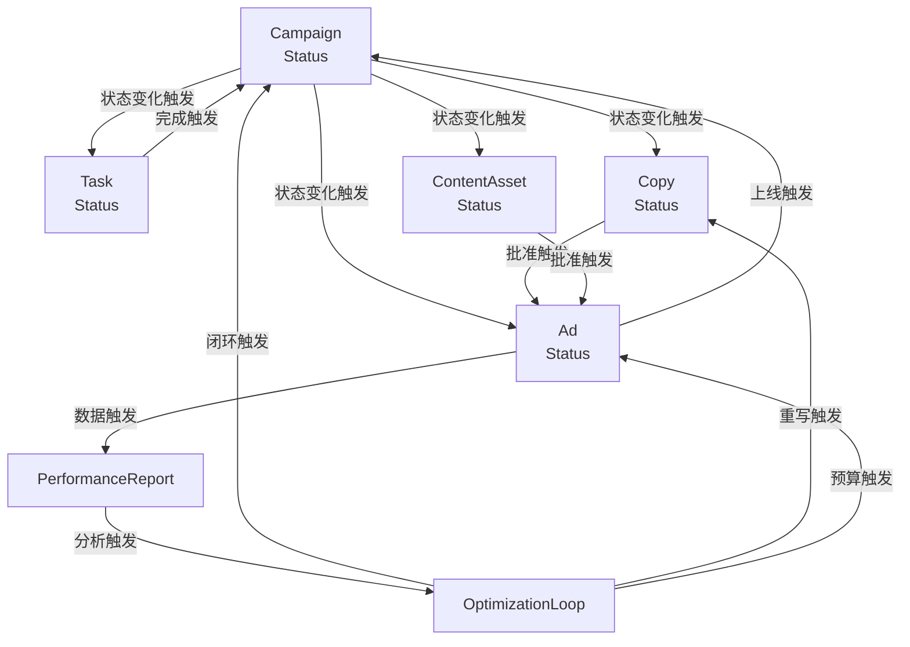
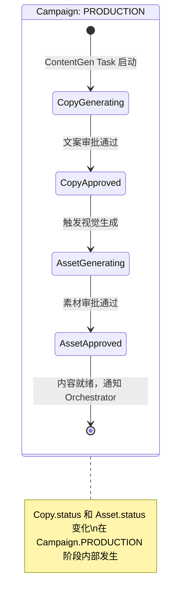

# 实体关系状态流转设计 — OpenAutoGrowth

> Version: 1.0 | Updated: 2026-04-09

本文档专注描述**实体之间的联动状态流转**：一个实体状态变化如何触发其他实体状态变化，确保整个系统的数据一致性与业务正确性。

---

## 1. 实体状态联动总览



---

## 2. Campaign ↔ Task 联动

### Campaign 驱动 Task
| Campaign 状态变化 | 触发的 Task 动作 |
| :--- | :--- |
| `DRAFT → PLANNING` | 创建 Planner Task (t0)，状态 = PENDING |
| `PLANNING → PENDING_REVIEW` | 所有 gen 类 Task 创建，状态 = WAITING |
| `PENDING_REVIEW → PRODUCTION` | 解除 WAITING，gen 类 Task 变 PENDING（可调度） |
| `→ PAUSED` | 所有 RUNNING Task 立即收到 PAUSE 信号 |
| `→ COMPLETED` | 所有剩余 Task 状态 → SKIPPED |

### Task 驱动 Campaign
| Task 状态变化 | 触发的 Campaign 动作 |
| :--- | :--- |
| 所有 `parallel_group=gen` 的 Task → DONE | Campaign 里程碑检查点：触发 PENDING_REVIEW |
| ChannelExec Task → DONE | Campaign → DEPLOYED |
| Analysis Task → DONE | Campaign → MONITORING（如已在则继续） |
| 任意关键 Task → BLOCKED | Campaign → PAUSED（带告警） |

---

## 3. Campaign ↔ 内容资产联动



**内容状态联动规则：**
- `Copy.status = APPROVED` + `Asset.status = APPROVED` → Orchestrator 收到信号，可推进至 ChannelExec
- `Copy.status = REJECTED` → ContentGen Task → FAILED → 重新调度 Task
- `Asset.status = GEN_FAILED` (3次) → Multimodal Task → BLOCKED → Campaign → PAUSED

---

## 4. Copy/Asset ↔ Ad 联动

```
Copy.status: APPROVED
     +
Asset.status: APPROVED
     ↓
ChannelExec Agent 创建 Ad
     ↓
Ad.status: PENDING
     ↓
平台审核通过
     ↓
Ad.status: ACTIVE  ─────→  Campaign.status: DEPLOYED / MONITORING

Ad.status: ACTIVE
     ↓
Optimizer: PAUSE_VARIANT 指令
     ↓
AdExec: 调用平台 API 暂停
     ↓
Ad.status: PAUSED  ─────→  Copy.status: PAUSED（同步标记）

Ad.status: ACTIVE（被替换）
     ↓
新 Copy 生成并上线
     ↓
旧 Ad.status: REPLACED → Copy.status: ARCHIVED
新 Ad.status: ACTIVE
```

---

## 5. Ad ↔ PerformanceReport 联动

```mermaid
sequenceDiagram
    participant ADS as Ad Platform
    participant ANA as Analytics Service
    participant RPT as PerformanceReport
    participant OPT as Optimizer

    loop 每小时
        ANA->>ADS: pull metrics (by ad_id)
        ADS-->>ANA: impressions, clicks, spend, conversions
        ANA->>RPT: upsert ChannelStats (period=current_hour)
        ANA->>RPT: recalculate summary KPIs
    end

    Note over RPT: 每日 23:00 触发完整归因

    ANA->>RPT: run attribution (Shapley Value)
    ANA->>RPT: generate full PerformanceReport
    RPT-->>ANA: report_id
    ANA->>OPT: publish ReportGenerated(report_id)
```

**归因联动规则：**
- `PerformanceReport.by_variant` → 将转化归因到具体 `copy_id` + `asset_id`
- 某 `copy_id` 的 `roas < 1.5` 且置信度 > 80% → `Optimizer` 发出针对该 `copy_id` 的 PAUSE 指令
- `Copy.status: PAUSED` + `Ad.status: PAUSED`（原子操作）

---

## 6. PerformanceReport ↔ OptimizationLoop 联动

```
PerformanceReport 生成
  → OptimizationLoop.status: TRIGGERED
  → Rule Engine 执行（见规则引擎文档）
  → OptimizationLoop.status: DECISION_MADE
  → 执行 Actions:

Action: PAUSE_VARIANT(copy_v2)
  联动:  Copy.status: PAUSED
         Ad(copy_id=copy_v2).status: PAUSED

Action: REALLOCATE_BUDGET(tiktok → meta, $5000)
  联动:  AdGroup(tiktok).budget: -5000
         AdGroup(meta).budget:   +5000

Action: TRIGGER_REWRITE(ContentGen)
  联动:  新 Task 加入 DAG
         ContentGen 重新生成
         新 Copy.status: GENERATING
         旧 Copy.status: ARCHIVED

  → OptimizationLoop.status: EXECUTING
  → 等待 24h 效果窗口
  → OptimizationLoop.status: EFFECT_VALIDATED / EFFECT_FAILED

EFFECT_VALIDATED:
  → OptimizationRecord 写入 Memory（供 Planner 下次参考）
  → Campaign.loop_count + 1
  → 检查 Campaign KPI:
      KPI 达成 → Campaign.status: COMPLETED
      未达成   → 触发下一个 OptimizationLoop (TRIGGERED)
```

---

## 7. 实体状态流转矩阵（全局视图）

| 触发事件 | Campaign | Task | Copy | Asset | Ad | OptLoop |
| :--- | :--- | :--- | :--- | :--- | :--- | :--- |
| 用户提交目标 | DRAFT→PLANNING | 创建t0: PENDING | - | - | - | - |
| Plan 生成完成 | PLANNING→PENDING_REVIEW | t1-tN: WAITING | - | - | - | - |
| 审批通过 | PENDING_REVIEW→PRODUCTION | WAITING→PENDING | GENERATING | GENERATING | - | - |
| 文案审核通过 | - | - | → APPROVED | - | - | - |
| 素材审核通过 | - | - | - | → APPROVED | PENDING | - |
| Ad 上线成功 | PRODUCTION→DEPLOYED | ChannelExec→DONE | → LIVE | → LIVE | → ACTIVE | - |
| 分析报告就绪 | MONITORING | Analysis→DONE | - | - | - | TRIGGERED |
| 优化动作执行 | →OPTIMIZING | 新Task加入 | 部分→PAUSED/ARCHIVED | 部分→ARCHIVED | 部分→PAUSED | →EXECUTING |
| 效果验证通过 | loop+1 | - | - | - | - | →COMMITTED |
| KPI 达成 | →COMPLETED | 剩余→SKIPPED | →ARCHIVED | →ARCHIVED | →PAUSED | - |
| 异常检测 | →PAUSED | 中断 | - | - | - | - |
