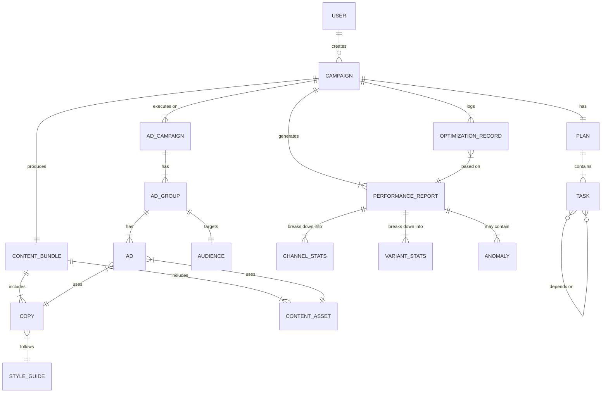

# 业务实体与关系定义 — OpenAutoGrowth

> Version: 1.0 | Updated: 2026-04-08

本文档定义系统中所有核心业务实体的字段规范，及实体间的关系（ER 模型）。

---

## 1. 实体关系总览图（ER Diagram）

---

## 2. 核心实体字段定义

### `USER` — 用户

| 字段 | 类型 | 约束 | 说明 |
| :--- | :--- | :--- | :--- |
| `id` | UUID | PK, NOT NULL | 用户唯一标识 |
| `name` | VARCHAR(100) | NOT NULL | 用户姓名 |
| `email` | VARCHAR(255) | UNIQUE, NOT NULL | 登录邮箱 |
| `role` | ENUM | NOT NULL | `ADMIN / MARKETER / VIEWER` |
| `org_id` | UUID | FK → ORG | 所属组织 |
| `created_at` | TIMESTAMP | NOT NULL | 注册时间 |

---

### `CAMPAIGN` — 投放活动（核心聚合根）

| 字段 | 类型 | 约束 | 说明 |
| :--- | :--- | :--- | :--- |
| `id` | UUID | PK | Campaign 唯一 ID |
| `name` | VARCHAR(200) | NOT NULL | 人类可读名称（如"X Pro 618冲刺"） |
| `owner_id` | UUID | FK → USER | 创建人 |
| `goal_description` | TEXT | NOT NULL | 自然语言目标描述 |
| `kpi_metric` | ENUM | NOT NULL | `GMV / CTR / ROI / CVR / CAC` |
| `kpi_target` | DECIMAL(18,4) | NOT NULL | KPI 目标数值 |
| `budget_total` | DECIMAL(18,2) | NOT NULL | 总预算 |
| `budget_daily_cap` | DECIMAL(18,2) | NULLABLE | 日预算上限 |
| `currency` | CHAR(3) | NOT NULL | `CNY / USD / EUR` |
| `start_date` | DATE | NOT NULL | 投放开始日期 |
| `end_date` | DATE | NOT NULL | 投放结束日期 |
| `status` | ENUM | NOT NULL | 见状态机文档 |
| `loop_count` | INTEGER | DEFAULT 0 | 优化闭环次数 |
| `created_at` | TIMESTAMP | NOT NULL | 创建时间 |
| `updated_at` | TIMESTAMP | NOT NULL | 最后更新时间 |

---

### `PLAN` — 任务规划

| 字段 | 类型 | 约束 | 说明 |
| :--- | :--- | :--- | :--- |
| `id` | UUID | PK | Plan 唯一 ID |
| `campaign_id` | UUID | FK → CAMPAIGN, UNIQUE | 每 Campaign 一个活跃 Plan |
| `dag_json` | JSONB | NOT NULL | DAG 完整结构快照 |
| `generated_by` | VARCHAR(50) | | `PLANNER_AGENT / HUMAN` |
| `created_at` | TIMESTAMP | NOT NULL | |

---

### `TASK` — DAG 任务节点

| 字段 | 类型 | 约束 | 说明 |
| :--- | :--- | :--- | :--- |
| `id` | UUID | PK | |
| `plan_id` | UUID | FK → PLAN | |
| `task_key` | VARCHAR(50) | NOT NULL | 如 `t1`, `t2` |
| `agent_type` | ENUM | NOT NULL | `PLANNER / CONTENT_GEN / MULTIMODAL / STRATEGY / CHANNEL_EXEC / ANALYSIS / OPTIMIZER` |
| `dependency_ids` | UUID[] | ARRAY FK | 前置任务 ID 列表 |
| `parallel_group` | VARCHAR(50) | NULLABLE | 同组任务可并行 |
| `status` | ENUM | NOT NULL | `PENDING / WAITING / RUNNING / DONE / FAILED / BLOCKED / SKIPPED` |
| `input_params` | JSONB | | 输入参数快照 |
| `output_result` | JSONB | NULLABLE | 输出结果快照 |
| `started_at` | TIMESTAMP | NULLABLE | |
| `completed_at` | TIMESTAMP | NULLABLE | |
| `retry_count` | INTEGER | DEFAULT 0 | |
| `error_message` | TEXT | NULLABLE | 失败原因 |

---

### `COPY` — 营销文案

| 字段 | 类型 | 约束 | 说明 |
| :--- | :--- | :--- | :--- |
| `id` | UUID | PK | |
| `bundle_id` | UUID | FK → CONTENT_BUNDLE | |
| `variant` | ENUM | NOT NULL | `A / B / C / CONTROL` |
| `channel` | ENUM | NOT NULL | `TIKTOK / META / GOOGLE / WECHAT / WEIBO` |
| `hook` | VARCHAR(100) | NOT NULL | 首句/标题 |
| `body` | TEXT | NOT NULL | 正文 |
| `cta` | VARCHAR(50) | NOT NULL | 行动号召语 |
| `tone` | VARCHAR(50) | | `energetic / professional / warm` |
| `word_count` | INTEGER | | |
| `generated_by` | VARCHAR(50) | | LLM 模型名称 |
| `status` | ENUM | NOT NULL | `GENERATING / APPROVED / REJECTED / LIVE / PAUSED / ARCHIVED` |
| `created_at` | TIMESTAMP | NOT NULL | |

---

### `CONTENT_ASSET` — 视觉素材

| 字段 | 类型 | 约束 | 说明 |
| :--- | :--- | :--- | :--- |
| `id` | UUID | PK | |
| `bundle_id` | UUID | FK → CONTENT_BUNDLE | |
| `type` | ENUM | NOT NULL | `IMAGE / VIDEO` |
| `url` | TEXT | NOT NULL | 素材存储 URL |
| `tool` | ENUM | NOT NULL | `DALLE3 / MIDJOURNEY / RUNWAY / PIKA / SORA` |
| `width` | INTEGER | | 像素宽度 |
| `height` | INTEGER | | 像素高度 |
| `duration_sec` | INTEGER | NULLABLE | 视频时长（秒） |
| `aspect_ratio` | VARCHAR(10) | | `9:16 / 1:1 / 16:9` |
| `prompt` | TEXT | | 生成时使用的 Prompt |
| `status` | ENUM | NOT NULL | `GENERATING / GENERATED / APPROVED / UPLOADING / LIVE / ARCHIVED` |
| `created_at` | TIMESTAMP | NOT NULL | |

---

### `AD` — 广告创意单元

| 字段 | 类型 | 约束 | 说明 |
| :--- | :--- | :--- | :--- |
| `id` | UUID | PK | |
| `ad_group_id` | UUID | FK → AD_GROUP | |
| `copy_id` | UUID | FK → COPY | |
| `asset_id` | UUID | FK → CONTENT_ASSET | |
| `platform_ad_id` | VARCHAR(100) | NULLABLE | 平台侧广告 ID |
| `status` | ENUM | NOT NULL | `PENDING / ACTIVE / PAUSED / DELETED` |
| `created_at` | TIMESTAMP | NOT NULL | |

---

### `PERFORMANCE_REPORT` — 绩效报告

| 字段 | 类型 | 约束 | 说明 |
| :--- | :--- | :--- | :--- |
| `id` | UUID | PK | |
| `campaign_id` | UUID | FK → CAMPAIGN | |
| `period_start` | DATE | NOT NULL | |
| `period_end` | DATE | NOT NULL | |
| `total_spend` | DECIMAL(18,2) | | |
| `total_revenue` | DECIMAL(18,2) | | |
| `impressions` | BIGINT | | |
| `clicks` | INTEGER | | |
| `conversions` | INTEGER | | |
| `ctr` | DECIMAL(8,6) | | 点击率 |
| `cvr` | DECIMAL(8,6) | | 转化率 |
| `cpa` | DECIMAL(18,2) | | 单次获取成本 |
| `roas` | DECIMAL(10,4) | | 广告支出回报率 |
| `roi` | DECIMAL(10,4) | | 投资回报率 |
| `attribution_model` | ENUM | | `LAST_CLICK / DATA_DRIVEN / LINEAR` |
| `generated_at` | TIMESTAMP | NOT NULL | |

---

### `OPTIMIZATION_RECORD` — 优化记录

| 字段 | 类型 | 约束 | 说明 |
| :--- | :--- | :--- | :--- |
| `id` | UUID | PK | |
| `campaign_id` | UUID | FK → CAMPAIGN | |
| `loop_number` | INTEGER | NOT NULL | 第几次优化循环 |
| `report_id` | UUID | FK → PERFORMANCE_REPORT | 基于哪份报告 |
| `actions` | JSONB | NOT NULL | 执行的优化动作列表 |
| `effect_validated` | BOOLEAN | NULLABLE | 效果是否验证 |
| `learnings` | TEXT | | 本次优化的经验总结 |
| `created_at` | TIMESTAMP | NOT NULL | |

---

## 3. 关键约束与业务规则

| 规则 | 说明 |
| :--- | :--- |
| **预算不可超支** | `AD_GROUP.budget_allocated` 之和 ≤ `CAMPAIGN.budget_total` |
| **文案必须先于上线** | `AD.copy_id` 对应 `COPY.status` 必须为 `APPROVED` |
| **闭环次数上限** | `CAMPAIGN.loop_count` 超过 10 次，强制人工介入 |
| **素材平台适配** | 上传至 TikTok 的视频必须为 `9:16`，Meta 图片建议 `1:1 / 4:5` |
| **A/B 分配互斥** | 同一 `AD_GROUP` 中同一 position 只能有 1 个 Active Ad |
